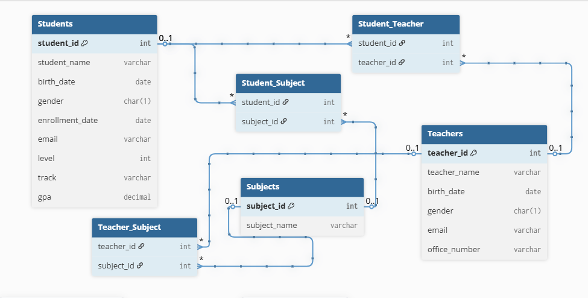

# SQL103 Project - Altamayoz School

This project is the continuation of **SQL101** and **SQL102**, applying advanced SQL concepts from the **SQL103 course**.

## Requirements
- Create relationships:
  - **Teachers ↔ Students** (Many-to-Many)
  - **Subjects ↔ Teachers** (Many-to-Many)
  - **Subjects ↔ Students** (Many-to-Many)
- Create a **Procedure** (`student_info`) that shows students with their enrolled subjects.
- Create a **View** (`teacher_info`) with teacher name, office number, and subject.
- Drop the view.
- Create an **Index** on student names.
- Show the index and drop it.

## Files
- **create_tables.sql** → Database & tables creation.
- **insert_data.sql** → Insert sample data (students, teachers, subjects).
- **Relationships.sql** → Relationships between tables, view, and index.
- **ERD.png** → Database relationships diagram.
- **README.md** → Project documentation.

## ERD (Entity Relationship Diagram)
The database relationships are designed as follows:

## 🔗 Previous Projects
- [SQL101 Project](https://github.com/almutawakilij-tech/SQL101-AltamayozSchool_DB)
- [SQL102 Project](https://github.com/almutawakilij-tech/SQL102-AltamayozSchool-DB)
